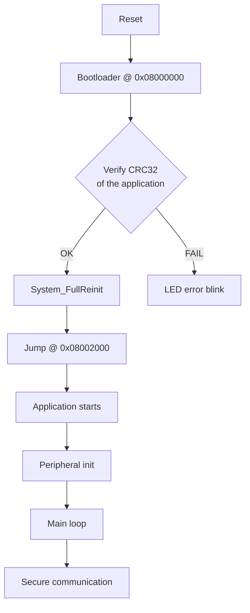

# STM32 Secure Boot & Application

> Secure boot system and protected application for STM32F103.
> AES-128-CBC encryption, HMAC-SHA256 authentication, anti-replay counter.

---

## Table of contents

- [Overview](#overview)
- [Architecture](#architecture)
- [Technologies](#technologies)
- [Features](#features)
- [Requirements](#requirements)
- [Installation](#installation)
- [Build](#build)
- [Flashing](#flashing)
- [LED indicators](#led-indicators)
- [Usage](#usage)
- [Communication protocol](#communication-protocol)
- [Security](#security)
- [Project structure](#project-structure)
- [Troubleshooting](#troubleshooting)

---

## 📋 Overview

The project ships a **secure boot loader** and a **protected application** for the STM32F103 microcontroller. Two components are involved:

### 1. Bootloader (`firmware/bootloader`)
- Located at **0x08000000** (8 KB)
- Verifies application integrity via **CRC32**
- Performs a clean jump into the application
- Full peripheral de-init before the jump

### 2. Application (`firmware/application`)
- Located at **0x08002000** (48 KB)
- Encrypted serial link (**AES-128-CBC**)
- Message authentication (**HMAC-SHA256**)
- **Anti-replay** with a sequence counter
- Both **JSON** and **TEXT** wire formats supported

---

## 🏗️ Architecture

### Flash memory map

```
┌─────────────────────────────────────────────┐
│  0x08000000 - 0x08001FFF (8 KB)            │
│  SECURE BOOTLOADER                          │
│  - CRC32 verification                       │
│  - System reinit                            │
│  - Jump into application                    │
├─────────────────────────────────────────────┤
│  0x08002000 - 0x0800DFFF (48 KB)           │
│  SECURE APPLICATION                         │
│  - Encrypted communication                  │
│  - HMAC authentication                      │
│  - Anti-replay                              │
│  - LED / PWM / ADC control                  │
└─────────────────────────────────────────────┘
```

### Boot flow



---

## Technologies

### STM32 peripherals

| Peripheral | Use | Configuration |
|------------|-----|---------------|
| **USART1** | Serial link | 115200 bps, 8N1, PA9/PA10 |
| **TIM2** | PWM generation | Channel 1 (PA0), 1 kHz |
| **ADC1** | Voltage reading | PA1 + internal temperature |
| **GPIO** | LED control | PC13 (active LOW) |
| **CRC** | Integrity check | Hardware CRC32 |
| **RCC** | Clock setup | 72 MHz (HSE + PLL) |
| **NVIC** | Interrupt management | Configurable priorities |

### Communication and protocol

| Technology | Implementation | Details |
|------------|----------------|---------|
| **UART interrupt-driven** | Async receive | 512-byte circular buffer |
| **UART DMA** | Optional | Zero-CPU transfers |
| **JSON parser** | Custom lightweight | Hand-written, memory-friendly |
| **TEXT parser** | Simple commands | `CMD:ARGS` format |

### Cryptography

| Algorithm | Library | Use |
|-----------|---------|-----|
| **AES-128-CBC** | mbedTLS | Message encryption |
| **HMAC-SHA256** | mbedTLS | Authentication |
| **CRC32** | STM32 hardware | Bootloader integrity check |
| **PRNG** | STM32 RNG (when available) | IV generation |

### Memory management

| Feature | Status | Description |
|---------|--------|-------------|
| **Stack protection** | Enabled | Overflow check |
| **Heap management** | Limited | `malloc()` avoided |
| **MPU** | Not configured | Hardware memory protection |
| **Flash protection** | Partial | RDP Level 0 (dev) |

### Software layers

```
┌────────────────────────────────────────────┐
│         HAL (Hardware Abstraction)         │
│  UART | GPIO | TIM | ADC | CRC | Flash    │
├────────────────────────────────────────────┤
│           Drivers & Middleware             │
│  Crypto | Protocol | Peripherals           │
├────────────────────────────────────────────┤
│            Application Logic               │
│  Command parser | State machine            │
├────────────────────────────────────────────┤
│          Security Layer (App)              │
│  AES-128-CBC | HMAC-SHA256 | Anti-Replay  │
└────────────────────────────────────────────┘

        ↑ Jump from Bootloader ↑

┌────────────────────────────────────────────┐
│          Bootloader (8 KB)                 │
│  CRC32 verify | System reinit | Jump       │
└────────────────────────────────────────────┘
```

### Interrupts in use

| IRQ | Priority | Use | Handler |
|-----|----------|-----|---------|
| **USART1_IRQn** | 1 | UART receive | `USART1_IRQHandler()` |
| **TIM2_IRQn** | 2 | PWM update | `TIM2_IRQHandler()` |
| **ADC1_2_IRQn** | 3 | ADC conversion | `ADC1_2_IRQHandler()` |
| **DMA1_Channel4_IRQn** | 1 | UART TX (DMA) | `DMA1_Channel4_IRQHandler()` |
| **DMA1_Channel5_IRQn** | 1 | UART RX (DMA) | `DMA1_Channel5_IRQHandler()` |

### DMA configuration

| Channel | Peripheral | Direction | Mode | Status |
|---------|------------|-----------|------|--------|
| **DMA1 Ch4** | USART1 TX | Memory → Peripheral | Normal | Optional |
| **DMA1 Ch5** | USART1 RX | Peripheral → Memory | Circular | Optional |
| **DMA1 Ch1** | ADC1 | Peripheral → Memory | Circular | Unused |

**Note:** the project currently uses plain UART interrupts to keep the code simple. DMA can be enabled by editing `uart_config.h`.

### Compile-time optimizations

| Flag | Description | Gain |
|------|-------------|------|
| **-Os** | Size optimization | ~30% size reduction |
| **-flto** | Link-time optimization | ~10% size reduction |
| **Inline functions** | Critical paths | ~5% speed improvement |
| **Constant-time crypto** | Side-channel protection | Security |
| **Zero-copy buffers** | DMA direct | Lower latency |

### Libraries

```ini
[env:bluepill_f103c8]
lib_deps =
    # Cryptography
    Mbed-TLS@^2.28.0

    # JSON parsing (custom, no external lib)
    # Hand-written to save memory
```

### Firmware footprint

```
┌─────────────────┬──────────┬──────────┬─────────┐
│   Component     │   Flash  │   RAM    │  Ratio  │
├─────────────────┼──────────┼──────────┼─────────┤
│ Bootloader      │   6.1 KB │  3.0 KB  │  75%    │
│ Application     │  38.4 KB │  8.7 KB  │  78%    │
│ - HAL           │  12.0 KB │  2.0 KB  │         │
│ - Crypto        │  18.5 KB │  4.5 KB  │         │
│ - Protocol      │   5.2 KB │  1.5 KB  │         │
│ - Peripherals   │   2.7 KB │  0.7 KB  │         │
└─────────────────┴──────────┴──────────┴─────────┘

Total used:     44.5 KB Flash / 11.7 KB RAM
Headroom:       19.5 KB Flash /  8.3 KB RAM
```

---

## Features

### Security

| Feature | Bootloader | Application |
|---------|-----------|-------------|
| **CRC32** | Integrity check | Checksum generation |
| **AES-128-CBC** | — | Message encryption |
| **HMAC-SHA256** | — | Message authentication |
| **Anti-Replay** | — | Sequence counter |
| **Secure Jump** | Yes | — |

### Communication

- Interface: USART1 (PA9/PA10)
- Baud rate: 115200
- Wire formats: JSON, TEXT
- Modes: encrypted (AES) or plain (DEBUG)

### Hardware control

- LED: PC13 (ON/OFF)
- PWM: TIM2 CH1 (PA0), 0-100%
- ADC: PA1 (voltage)
- Internal temperature sensor via ADC

---

## Requirements

### Hardware

- Board: STM32F103C8T6 (Blue Pill or equivalent)
- Programmer: ST-Link V2/V3
- USB-UART adapter for the serial link
- LED on PC13 (usually onboard)
- Optional potentiometer on PA1

### Tooling

```bash
# PlatformIO CLI
pip install platformio

# Or the PlatformIO IDE (VS Code extension)
# https://platformio.org/install/ide?install=vscode

# ST-Link tools (Linux)
sudo apt install stlink-tools

# ST-Link tools (macOS)
brew install stlink

# ST-Link tools (Windows)
# Download from: https://www.st.com/en/development-tools/stsw-link004.html
```

---

## Installation

### 1. Clone

```bash
git clone https://github.com/BechirYengui/stm32-control-suite.git
cd stm32-control-suite/firmware
```

### 2. Layout

```
firmware/
├── bootloader/                # Secure boot
│   ├── src/
│   │   └── main.c
│   ├── include/
│   ├── lib/
│   │   └── crypto/
│   ├── test/                  # unit, integration, etc.
│   └── platformio.ini
│
└── application/               # Secure application
    ├── src/
    │   └── main.c
    ├── include/
    ├── lib/
    ├── tools/
    │   ├── post_build.py
    │   ├── pre_build.py
    │   └── firmware_signer.py
    ├── test/
    └── platformio.ini
```

---

## Build

### Option 1: full automated build (recommended)

```bash
chmod +x build_all.sh
./build_all.sh
```

The script builds:
1. The bootloader (`firmware/bootloader`)
2. The application (`firmware/application`)
3. Reports memory usage
4. Stages binaries for flashing

### Option 2: manual build

#### Step 1: build the bootloader

```bash
cd firmware/bootloader
pio run

# Check the size (must stay under 8 KB)
pio run --target size

# Output:
# .pio/build/bluepill_f103c8/firmware.bin
```

#### Step 2: build the application

```bash
cd ../application
pio run

# Check the size (must stay under 48 KB)
pio run --target size

# Output:
# .pio/build/bluepill_f103c8/firmware.bin
```

### Size sanity check

```bash
# Bootloader: MAX 8 KB (8192 bytes)
RAM:   [==        ]  15.2% (used 3120 bytes from 20480 bytes)
Flash: [===       ]  29.8% (used 6248 bytes from 20971520 bytes)

# Application: MAX 48 KB (49152 bytes)
RAM:   [====      ]  42.3% (used 8660 bytes from 20480 bytes)
Flash: [=======   ]  73.5% (used 38420 bytes from 52428800 bytes)
```

---

## Flashing

### ⚠️ Order matters: always flash the bootloader first.

### Method 1: PlatformIO (recommended)

```bash
# 1. Flash the BOOTLOADER at 0x08000000
cd firmware/bootloader
pio run --target upload

# 2. Flash the APPLICATION at 0x08002000
cd ../application
pio run --target upload

# 3. Reset the STM32
pio device monitor --echo --filter send_on_enter
```

### Method 2: ST-Link CLI

```bash
# 1. Erase the full flash (recommended)
st-flash erase

# 2. Flash the BOOTLOADER @ 0x08000000
st-flash --reset write \
    firmware/bootloader/.pio/build/bluepill_f103c8/firmware.bin \
    0x08000000

# 3. Flash the APPLICATION @ 0x08002000
st-flash --reset write \
    firmware/application/.pio/build/bluepill_f103c8/firmware.bin \
    0x08002000

# 4. Verify
st-info --probe
```

### Method 3: shell script

```bash
#!/bin/bash
# flash_all.sh

echo "Flashing the full STM32 Secure system"

# Erase
echo "1/3 Erasing flash..."
st-flash erase

# Bootloader
echo "2/3 Flashing bootloader @ 0x08000000..."
st-flash --reset write \
    firmware/bootloader/.pio/build/bluepill_f103c8/firmware.bin \
    0x08000000

sleep 2

# Application
echo "3/3 Flashing application @ 0x08002000..."
st-flash --reset write \
    firmware/application/.pio/build/bluepill_f103c8/firmware.bin \
    0x08002000

echo "Done. The system should boot now."
```

---

## LED indicators

### Normal startup sequence

After a successful flash, watch the onboard LED (PC13) to confirm everything is in order.

#### Phase 1: Bootloader (0-2 seconds)

```
┌─────────────────────────────────────────────────────────┐
│  LED behavior: fast blink (5 Hz)                       │
│  Status: Bootloader running                            │
│  Duration: ~500 ms                                      │
└─────────────────────────────────────────────────────────┘

Sequence:
  ┌──┐  ┌──┐  ┌──┐
──┘  └──┘  └──┘  └──  (100 ms ON / 100 ms OFF)

Meaning:
  - Bootloader started correctly
  - CRC32 verification in progress
  - About to jump into the application
```

#### Phase 2: Application running (after 2 seconds)

```
┌─────────────────────────────────────────────────────────┐
│  LED behavior: slow blink (1 Hz)                       │
│  Status: Application running                           │
│  Duration: continuous (heartbeat)                       │
└─────────────────────────────────────────────────────────┘

Sequence:
      ┌─────┐      ┌─────┐      ┌─────┐
──────┘     └──────┘     └──────┘     └──  (500 ms ON / 500 ms OFF)

Meaning:
  - Application is running normally
  - Peripherals initialized
  - UART communication ready
  - Secure subsystem operational
```

#### Phase 3: Active communication

```
┌─────────────────────────────────────────────────────────┐
│  LED behavior: brief flash on every incoming command    │
│  Status: Receiving / processing commands               │
│  Duration: 50 ms per flash                              │
└─────────────────────────────────────────────────────────┘

Sequence:
              ┌┐        ┌┐           ┌┐
──────────────┘└────────┘└───────────┘└──  (50 ms flash)

Meaning:
  - Command received over UART
  - Message decrypted (if encrypted)
  - HMAC validated
  - Command being processed
```

### LED error codes

| Pattern | Frequency | Meaning | Action |
|---------|-----------|---------|--------|
| **Very fast blink** | 10 Hz (50 ms) | CRC32 invalid | Re-flash application |
| **Solid ON** | Static | Hard fault / crash | Reset + check code |
| **Solid OFF** | Static | Bootloader stuck | Re-flash bootloader |
| **2 short flashes** | 2 Hz | UART timeout | Check serial wiring |
| **3 short flashes** | 2 Hz | HMAC invalid | Check crypto keys |
| **1 long flash** | 1 Hz | Command OK | Normal |

### Error code details

#### 1. Invalid CRC32 (10 Hz blink)

```
Cause:
  - Corrupted application
  - Partial flash write
  - Wrong offset

Fix:
  1. Erase flash: st-flash erase
  2. Re-flash application @ 0x08002000
  3. Check platformio.ini: board_upload.offset_address = 0x08002000

LED pattern:
┌┐┌┐┌┐┌┐┌┐┌┐┌┐┌┐┌┐┌┐
└┘└┘└┘└┘└┘└┘└┘└┘└┘└┘  (50 ms ON / 50 ms OFF)
```

#### 2. Hard fault / crash (LED solid ON)

```
Cause:
  - Stack overflow
  - Null pointer dereference
  - Memory corruption

Fix:
  1. Attach the ST-Link debugger
  2. Read the fault registers
  3. Check stack usage
  4. Increase stack size if needed

LED:
████████████████████  (always ON)
```

#### 3. Bootloader stuck (LED solid OFF)

```
Cause:
  - Bootloader not flashed
  - Wrong bootloader offset
  - Hardware fault

Fix:
  1. Check the ST-Link connection
  2. Re-flash bootloader @ 0x08000000
  3. Check the 3.3V power supply

LED:
────────────────────  (always OFF)
```

#### 4. UART timeout (2 short flashes)

```
Cause:
  - No serial connection
  - Wrong baud rate
  - TX/RX swapped

Fix:
  1. Check TX/RX: PA9 (TX) ↔ RX, PA10 (RX) ↔ TX
  2. Confirm baud rate: 115200 bps
  3. Test with: minicom -D /dev/ttyUSB0 -b 115200

LED pattern:
  ┌┐ ┌┐     ┌┐ ┌┐     ┌┐ ┌┐
──┘└─┘└─────┘└─┘└─────┘└─┘└──  (2×100 ms, 500 ms gap)
```

#### 5. Invalid HMAC (3 short flashes)

```
Cause:
  - AES/HMAC keys differ between PC and STM32
  - Corrupted message
  - Sequence counter out of sync

Fix:
  1. Check the keys in crypto.h (STM32) and Qt side (DeviceController)
  2. Reset the sequence counter
  3. Send a plain TEXT command first: AUTH:admin:password

LED pattern:
  ┌┐ ┌┐ ┌┐     ┌┐ ┌┐ ┌┐     ┌┐ ┌┐ ┌┐
──┘└─┘└─┘└─────┘└─┘└─┘└─────┘└─┘└─┘└──  (3×100 ms, 500 ms gap)
```

### Manual LED test

To manually exercise the LED after flashing:

```c
// drop into main.c temporarily for debug

// Test 1: LED solid ON
HAL_GPIO_WritePin(GPIOC, GPIO_PIN_13, GPIO_PIN_RESET);  // ON
HAL_Delay(2000);

// Test 2: LED solid OFF
HAL_GPIO_WritePin(GPIOC, GPIO_PIN_13, GPIO_PIN_SET);    // OFF
HAL_Delay(2000);

// Test 3: 1 Hz blink
for (int i = 0; i < 10; i++) {
    HAL_GPIO_TogglePin(GPIOC, GPIO_PIN_13);
    HAL_Delay(500);
}
```

### Flash verification flow

```
                    [STM32 RESET]
                          │
                          ▼
            ┌─────────────────────────┐
            │  LED blinking at 5 Hz?  │
            │  (Bootloader active)    │
            └─────────┬───────────────┘
                      │
          ┌───────────┴───────────┐
          │ YES                   │ NO
          ▼                       ▼
    ┌─────────────┐      ┌──────────────────┐
    │ Wait        │      │ PROBLEM:         │
    │ 2 seconds   │      │ Bootloader       │
    └──────┬──────┘      │ not flashed      │
           │             └──────────────────┘
           ▼
    ┌─────────────────────────┐
    │ LED blinking at 1 Hz?   │
    │ (Application active)    │
    └─────────┬───────────────┘
              │
    ┌─────────┴─────────┐
    │ YES               │ NO
    ▼                   ▼
┌──────────┐   ┌──────────────────┐
│ OK!      │   │ PROBLEM:         │
│ System   │   │ Application      │
│ ready    │   │ does not start   │
└──────────┘   └──────────────────┘
```

### LED diagnostic commands

Once the system is up, test the LED over UART:

```bash
# Serial connection
minicom -D /dev/ttyUSB0 -b 115200

# Test commands
LED:ON          # turn LED on (should stay on)
LED:OFF         # turn LED off (should turn off)
LED:BLINK       # blink 5 times (automatic test)
STATUS          # full peripheral state
```

Expected replies:
```
> LED:ON
OK: LED ON

> LED:OFF
OK: LED OFF

> STATUS
STATUS: {"led":"ON","pwm":50,"temp":23.5,"voltage":3.28,"uptime":1234}
```

---

## Usage

### 1. Open the serial port

```bash
# Linux/macOS
screen /dev/ttyUSB0 115200
# or
minicom -D /dev/ttyUSB0 -b 115200

# Windows (PuTTY or Tera Term)
# Port: COMx, Baud: 115200
```

### 2. Startup banner

```
╔═══════════════════════════════════════════════════════════════╗
║       STM32 Secure Boot System - Version 1.0.0               ║
╠═══════════════════════════════════════════════════════════════╣
║  Configuration:                                               ║
║     - Bootloader @ 0x08000000 (8 KB)                         ║
║     - Application @ 0x08002000 (48 KB)                       ║
╠═══════════════════════════════════════════════════════════════╣
║  Integrity check...                                          ║
║     CRC32 application: 0xABCD1234 OK                         ║
║     Signature valid                                           ║
╠═══════════════════════════════════════════════════════════════╣
║  Booting secure application...                               ║
╚═══════════════════════════════════════════════════════════════╝

╔═══════════════════════════════════════════════════════════════╗
║       STM32 Secure Application - Version 2.1.0               ║
╠═══════════════════════════════════════════════════════════════╣
║  Encryption: AES-128-CBC                                      ║
║  Authentication: HMAC-SHA256                                  ║
║  Anti-Replay: enabled                                         ║
╠═══════════════════════════════════════════════════════════════╣
║  Peripherals initialized:                                     ║
║     - LED: PC13                                              ║
║     - PWM: TIM2_CH1 (PA0)                                    ║
║     - ADC: PA1 + internal temp                               ║
║     - UART: 115200 bps                                       ║
╚═══════════════════════════════════════════════════════════════╝

READY
```

### 3. Available commands

#### TEXT format (debug)

```bash
# LED control
LED:ON          # turn LED on
LED:OFF         # turn LED off

# PWM control (0-100%)
PWM:50          # set PWM to 50%
PWM:75          # set PWM to 75%

# Sensors
TEMP            # read internal temperature
VOLTAGE         # read voltage on PA1
STATUS          # full state

# System
RESET           # reset the MCU
HELP            # show help

# Auth
AUTH:admin:password     # authenticate
```

#### JSON format (production)

```json
// LED control
{"cmd":"LED","state":"ON"}
{"cmd":"LED","state":"OFF"}

// PWM control
{"cmd":"PWM","value":50}

// Sensors
{"cmd":"TEMP"}
{"cmd":"VOLTAGE"}
{"cmd":"STATUS"}

// Auth
{"cmd":"AUTH","user":"admin","pass":"password"}
```

### 4. Responses

#### TEXT mode

```
OK: LED ON
OK: PWM=50%
TEMP: 23.5°C
VOLTAGE: 2.45V
STATUS: {"led":"ON","pwm":50,"temp":23.5,"voltage":2.45}
ERROR: Invalid command
```

#### JSON mode

```json
{"status":"ok","msg":"LED ON"}
{"status":"ok","pwm":50}
{"status":"ok","temp":23.5}
{"status":"ok","voltage":2.45}
{"status":"ok","data":{"led":"ON","pwm":50,"temp":23.5}}
{"status":"error","msg":"Invalid command"}
```

---

## Communication protocol

### Security architecture

```
┌─────────────┐                  ┌─────────────┐
│   PC/Qt     │                  │   STM32     │
│  Interface  │                  │ Application │
└──────┬──────┘                  └──────┬──────┘
       │                                │
       │  1. Plain message              │
       ├──────────────────────────────>│
       │                                │
       │  2. AES-128-CBC encryption    │
       │     + HMAC-SHA256              │
       │     + sequence counter         │
       │<───────────────────────────────┤
       │                                │
       │  3. Encrypted message          │
       ├──────────────────────────────>│
       │                                │
       │  4. Verification:              │
       │     - HMAC valid?              │
       │     - Sequence valid?          │
       │     - Decrypt                  │
       │<───────────────────────────────┤
       │                                │
       │  5. Encrypted reply            │
       │<───────────────────────────────┤
       │                                │
```

### Encrypted message layout

```
┌────────────────────────────────────────────────────────┐
│  HEADER (4 bytes)                                      │
│  - Magic: 0xAA 0x55                                    │
│  - Length: 2 bytes                                     │
├────────────────────────────────────────────────────────┤
│  IV (16 bytes)                                         │
│  - AES initialization vector                           │
├────────────────────────────────────────────────────────┤
│  SEQUENCE (4 bytes)                                    │
│  - Anti-replay counter                                 │
├────────────────────────────────────────────────────────┤
│  ENCRYPTED DATA (variable)                             │
│  - AES-128-CBC ciphertext                              │
├────────────────────────────────────────────────────────┤
│  HMAC (32 bytes)                                       │
│  - HMAC-SHA256 over the previous fields                │
└────────────────────────────────────────────────────────┘
```

### Crypto keys

**Warning:** the values below are test vectors. **Do not use them in production.**

```c
// AES-128 key (16 bytes)
const uint8_t AES_KEY[16] = {
    0x2b, 0x7e, 0x15, 0x16, 0x28, 0xae, 0xd2, 0xa6,
    0xab, 0xf7, 0xcf, 0x97, 0x52, 0x43, 0x10, 0x11
};

// HMAC-SHA256 key (32 bytes)
const uint8_t HMAC_KEY[32] = {
    0x00, 0x01, 0x02, 0x03, 0x04, 0x05, 0x06, 0x07,
    0x08, 0x09, 0x0a, 0x0b, 0x0c, 0x0d, 0x0e, 0x0f,
    0x10, 0x11, 0x12, 0x13, 0x14, 0x15, 0x16, 0x17,
    0x18, 0x19, 0x1a, 0x1b, 0x1c, 0x1d, 0x1e, 0x1f
};
```

For production:
1. Generate per-device unique keys
2. Store them in protected memory (Flash OTP, Secure Element)
3. Use a proper key management system

---

## 🔐 Security

### Implemented measures

| Measure | Description | Status |
|---------|-------------|--------|
| **Secure Boot** | CRC32 verification before boot | Enabled |
| **Code Signing** | Application signature | Partial |
| **Encryption** | AES-128-CBC on the wire | Enabled |
| **Authentication** | HMAC-SHA256 on messages | Enabled |
| **Anti-Replay** | Monotonic sequence counter | Enabled |
| **Memory Protection** | MPU not configured | Disabled |
| **Debug Lock** | Debug active (dev mode) | Disabled |
| **Read Protection** | RDP Level 0 | Disabled |

### Production hardening checklist

```bash
# 1. Enable Read Protection (RDP Level 1)
# Prevents reading flash via debug

# 2. Disable debug (JTAG/SWD)
# In platformio.ini:
build_flags =
    -D DISABLE_DEBUG

# 3. Enable the MPU (Memory Protection Unit)
# Isolate bootloader and application memory regions

# 4. Use per-device keys
# Generated at production time, stored in OTP

# 5. Add an external Secure Element
# e.g. ATECC608A for key storage
```

### Threats and mitigations

| Threat | Impact | Mitigation |
|--------|--------|------------|
| **Flash dump** | Critical | RDP Level 1/2 |
| **Debug access** | Critical | Disable JTAG/SWD |
| **Replay attack** | Medium | Sequence counter (done) |
| **MITM** | Medium | HMAC-SHA256 (done) |
| **Brute force** | Low | Timeouts + lockout |
| **Side channel** | Medium | Constant-time crypto |

---

## Project structure

### Bootloader (`firmware/bootloader`)

```
firmware/bootloader/
├── platformio.ini              # PlatformIO config
├── src/
│   └── main.c                  # Entry point, main loop
├── include/                    # Public headers
├── lib/
│   └── crypto/                 # Lightweight crypto helpers
└── test/                       # unit, integration, etc.
```

Key functions:

```c
// CRC32 verification of the application
bool verify_application_crc(uint32_t app_start, uint32_t app_size);

// Full peripheral and clock reinit
void System_FullReinit(void);

// Safe jump into the application
void jump_to_application(uint32_t app_address);
```

### Application (`firmware/application`)

```
firmware/application/
├── platformio.ini              # PlatformIO config
├── src/
│   ├── main.c                  # Entry point
│   ├── crypto.c                # Cryptography
│   ├── protocol.c              # Protocol handling
│   └── peripherals.c           # Hardware control
├── include/
│   ├── crypto.h
│   ├── protocol.h
│   └── peripherals.h
├── lib/
├── tools/
│   ├── post_build.py
│   ├── pre_build.py
│   └── firmware_signer.py
└── test/
```

Key functions:

```c
// AES-128-CBC encryption
int aes_encrypt(uint8_t *plaintext, size_t len,
                uint8_t *ciphertext, uint8_t *iv);

// HMAC authentication
int hmac_sha256(uint8_t *data, size_t len,
                uint8_t *key, uint8_t *hmac);

// JSON command parsing
int parse_json_command(char *json, Command *cmd);

// LED control
void LED_Control(bool state);

// PWM 0-100%
void PWM_SetDutyCycle(uint8_t duty);
```

---

## Troubleshooting

### The bootloader does not start

**Symptoms:**
- No UART output
- LED does not blink

**Fix:**
```bash
# 1. Check the ST-Link connection
st-info --probe

# 2. Erase the full flash
st-flash erase

# 3. Re-flash the bootloader
st-flash --reset write firmware.bin 0x08000000

# 4. Check the option bytes
st-flash --reset read option_bytes.bin 0x1FFFF800 16
```

### The application does not start

**Symptoms:**
- Bootloader runs but the application never comes up
- "CRC verification failed" message

**Fix:**
```bash
# 1. Check the application offset
# In the application platformio.ini:
board_upload.offset_address = 0x08002000

# 2. Check the vector table
# In src/main.c:
__attribute__((section(".isr_vector")))

# 3. Re-flash the application
cd firmware/application
pio run --target upload

# 4. Recompute the CRC manually
crc32 .pio/build/bluepill_f103c8/firmware.bin
```

### UART communication is broken

**Symptoms:**
- No reply from the STM32
- Garbled characters

**Fix:**
```bash
# 1. Confirm the baud rate
# Must be 115200 on both ends

# 2. Confirm UART pins
# TX: PA9
# RX: PA10

# 3. Try with minicom
minicom -D /dev/ttyUSB0 -b 115200

# 4. Bump the UART buffer
# In protocol.c:
#define UART_BUFFER_SIZE 512
```

### Encrypted messages rejected

**Symptoms:**
- "HMAC verification failed"
- "Invalid sequence number"

**Fix:**
```c
// 1. Check the AES/HMAC keys
// They must match between the Qt side and the STM32

// 2. Reset the sequence counter
// In crypto.c:
sequence_counter = 0;

// 3. Verify the message layout
// HEADER + IV + SEQ + DATA + HMAC

// 4. Temporary debug mode
#define DEBUG_CRYPTO 1
```

### LED does not turn on

**Symptoms:**
- `LED:ON` has no effect
- No error reported

**Fix:**
```c
// 1. Check the LED pin
// PC13 on the Blue Pill (active LOW)

// 2. Test directly
HAL_GPIO_WritePin(GPIOC, GPIO_PIN_13, GPIO_PIN_RESET); // ON
HAL_GPIO_WritePin(GPIOC, GPIO_PIN_13, GPIO_PIN_SET);   // OFF

// 3. Check GPIO init
// In peripherals.c:
__HAL_RCC_GPIOC_CLK_ENABLE();
```

### Firmware too large

**Symptoms:**
```
Error: firmware size exceeds available flash
```

**Fix:**
```ini
# 1. Enable size optimization in platformio.ini
build_flags =
    -Os                 # optimize for size
    -flto               # link-time optimization

# 2. Drop unused features
build_flags =
    -D DISABLE_JSON     # if TEXT is enough
    -D DISABLE_CRYPTO   # debug only

# 3. Check the size
pio run --target size
```

---

## License

This project is licensed under the MIT License. See the `LICENSE` file for details.

---

## Disclaimer

This project is provided for educational and development purposes. It should not be used in production without a full security audit, per-device unique keys, read protection enabled, penetration testing, and compliance with relevant standards (IEC 62443, etc.).

---

## Author

**Bechir Yengui** — [github.com/BechirYengui](https://github.com/BechirYengui)
